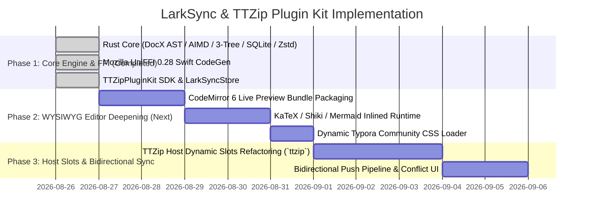

# Implementation Plan: LarkSync TTZip Plugin & Typora-Grade WYSIWYG Editor

- **Feature Directory**: `specs/001-larksync-ttzip-plugin-wysiwyg-editor`
- **Classification**: `[Full SDD]`
- **Status**: `Phase 1 Design Complete`
- **Created**: 2026-08-26
- **Author**: Witt Kung & Antigravity AI Team
- **License**: BSD-3-Clause OR Apache-2.0

---

## 1. Technical Context & Scope

LarkSync replaces the previous TypeScript / VS Code extension architecture with a native, zero-debt architecture:
- **Rust Core**: Tokio + Reqwest (AIMD flow control) + Pulldown-cmark + Similar + SQLite (WAL) + Tar/Zstd.
- **FFI Layer**: Mozilla UniFFI 0.28 proc-macro exporting to Swift 6 Strict Concurrency.
- **Plugin SDK**: `TTZipPluginKit` defining 8 standard extension points under Object-Capability security.
- **WYSIWYG Editor**: `TTMarkdownKit` based on CodeMirror 6 Live Preview + dual-tier theme system + WebKit CoreText vector PDF / Retina 2x PNG export.

---

## 2. Design Artifacts Index

| Artifact | Path | Purpose |
| :--- | :--- | :--- |
| **Feature Spec** | `specs/001-larksync-ttzip-plugin-wysiwyg-editor/spec.md` | Requirements & user stories |
| **Research & Decisions** | `specs/001-larksync-ttzip-plugin-wysiwyg-editor/research.md` | SOTA decisions (Wasm/UniFFI, CM6, 3-Tree) |
| **Data Model** | `specs/001-larksync-ttzip-plugin-wysiwyg-editor/data-model.md` | Entities & 3-Tree state transition matrix |
| **Plugin Contract** | `specs/001-larksync-ttzip-plugin-wysiwyg-editor/contracts/plugin-protocol.md` | TTZipPlugin 8 standard extension points |
| **UniFFI Contract** | `specs/001-larksync-ttzip-plugin-wysiwyg-editor/contracts/uniffi-interface.md` | Strong-typed Swift/Rust FFI API |
| **Quickstart** | `specs/001-larksync-ttzip-plugin-wysiwyg-editor/quickstart.md` | Verification & build instructions |

---

## 3. Phased Implementation Roadmap

