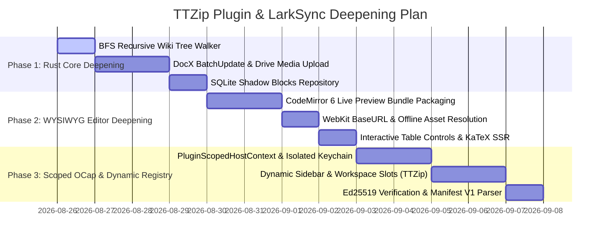

# Implementation Plan: 002 TTZip Plugin Engine & LarkSync Deepening

- **Feature Directory**: `specs/002-ttzip-plugin-engine-and-larksync-deepening`
- **Classification**: `[Full SDD]`
- **Status**: `Phase 1 Design Complete`
- **Created**: 2026-08-26
- **Author**: Witt Kung & Antigravity AI Team
- **License**: BSD-3-Clause OR Apache-2.0

---

## 1. Technical Context & Scope

Following our comprehensive 3-agent audit, this plan addresses all identified defects across:
- **Rust Core**: Fix multi-level directory BFS recursion, implement `batch_update_docx_blocks` and `upload_drive_media`, and add SQLite `shadow_blocks` mapping.
- **Plugin Architecture**: Scoped OCap host context, isolated Keychain namespaces, Ed25519 signature checks, and dynamic sidebar/workspace rendering.
- **Markdown Editor**: CodeMirror 6 Live Preview bundle integration, BaseURL relative image resolution, and IME protection.

---

## 2. Design Artifacts Index

| Artifact | Path | Purpose |
| :--- | :--- | :--- |
| **Feature Spec** | `specs/002-ttzip-plugin-engine-and-larksync-deepening/spec.md` | Core requirements & acceptance criteria |
| **Research & Decisions** | `specs/002-ttzip-plugin-engine-and-larksync-deepening/research.md` | OCap, BFS walker, CM6 AST folding decisions |
| **Data Model** | `specs/002-ttzip-plugin-engine-and-larksync-deepening/data-model.md` | Shadow blocks schema, Manifest V1, state machine |
| **Scoped Context Contract** | `specs/002-ttzip-plugin-engine-and-larksync-deepening/contracts/host-context-scoped.md` | Scoped Host Context & Strong-typed EventBus |
| **Feishu Write API** | `specs/002-ttzip-plugin-engine-and-larksync-deepening/contracts/feishu-write-api.md` | DocX Batch Update & Media Upload API |
| **Quickstart Guide** | `specs/002-ttzip-plugin-engine-and-larksync-deepening/quickstart.md` | Verification instructions |

---

## 3. Phased Implementation Roadmap

